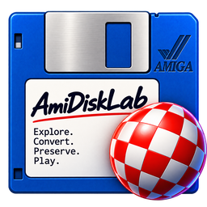

<p align="center">
  
</p>

<h1 align="center">AmiDiskLab</h1>

<p align="center">
  <strong>Amiga Disk &amp; Software Manager</strong><br>
  Organize disk collections, enrich them with metadata, and create or extract ADF images.
</p>


<p align="center">
  <a href="https://github.com/gruetze-software/AmiDiskLab/releases/latest"></a>
  <a href="https://github.com/gruetze-software/AmiDiskLab/actions/workflows/build.yml"></a>
  <a href="LICENSE"></a>
</p>

## Ready for Windows, Linux, and macOS

AmiDiskLab 1.2 is available as a **self-contained desktop application** for:

- Windows x64
- Linux x64
- macOS on Apple Silicon
- macOS on Intel

**No separate .NET runtime or SDK installation is required.** Download the package for your
platform from the [latest release](https://github.com/gruetze-software/AmiDiskLab/releases/latest),
extract it, and start AmiDiskLab.

## Highlights

### Manage Amiga software collections

- Scan folders recursively for **ADF, HFE, DMS, IPF, and LHA** files.
- Remember and automatically reopen the last selected collection.
- Detect byte-identical duplicates with SHA-256 and mark their rows in red.
- Sort by name, type, format, category, genre, publisher, studio, release year, rating, or size.
- Open the containing folder, cover, or screenshot directly from the context menu.

### Recognize multi-disk games

AmiDiskLab groups common disk naming schemes into a single collection entry, including
`Game (Disk 1 of 3)`, `Game (A)` through `Game (F)`, `Game 1-2`, and numbered names such
as `Game01`. Original disk files remain separate and unchanged. The list shows the disk
count and stores shared metadata for the complete set.

### Find rich game metadata

**Find game metadata (ScreenScraper.fr)** supports hash and name-based matching:

- CRC32, MD5, SHA-1, file size, and filename lookup
- alternative cleaned-title searches when no hash match exists
- regional titles, dates, and covers
- localized descriptions and genres
- publisher and developer/studio information
- ratings, cover art, screenshots, and company logos
- multiple-result selection when a search is ambiguous
- collection-wide batch enrichment with account-aware parallel requests, quota monitoring,
  automatic saving of exact hash matches, and a live activity log

Cover art, screenshots, and logos are cached locally for offline use. A personal
ScreenScraper account is optional. On Windows, optional personal credentials are encrypted
with Windows DPAPI. On Linux and macOS they are used only for the current session and are
not stored.

ScreenScraper developer credentials are never included in the application. Requests use a
restricted proxy hosted on Cloudflare Workers, and media URLs are replaced with short-lived
encrypted download links. ADF contents are not uploaded.

### Find Amiga scene metadata

**Find scene metadata (Demozoo)** searches by exact production title, numeric production ID,
or Demozoo link. It can import the production title and type, scene group, release date, and
available production images. Scene images can serve as cover and screenshot artwork and are
cached for offline use.

### Edit and browse metadata offline

- Edit title, studio/developer, publisher, release date, category, genre, rating,
  description, and scene information.
- Display publisher and studio logos directly in the collection.
- Prefer color logos and share centrally cached company logos between titles.
- Use a screenshot as the list thumbnail when no cover is available.
- Double-click an entry to edit its metadata or artwork to open it in the registered viewer.

### Create and extract ADF images

- Create standard **880 KiB FFS data ADFs** (`DOS\1`) from folders or suitable archives.
- Create **OFS A500 boot ADFs** (`DOS\0`) for compatible AmigaDOS Hunk executables.
- Configure Kickstart 1.3, 2.0, or 3.1 and 1–8 MiB RAM as the target A500 profile.
- Extract embedded 901,120-byte disk images from WHDLoad packages without altering them.
- Preserve an existing destination if validation, writing, or final replacement fails.

WHDLoad packages cannot be converted automatically into standalone bootable Gotek disks.
Their `.Slave` files require a prepared WHDLoad environment. Use original bootable disk
images when a package does not contain suitable embedded ADF data.

## Downloads and first start

Download [AmiDiskLab 1.2](https://github.com/gruetze-software/AmiDiskLab/releases/tag/v1.2):

| Platform | Package |
| --- | --- |
| Windows x64 | [AmiDiskLab-Windows-x64.zip](https://github.com/gruetze-software/AmiDiskLab/releases/download/v1.2/AmiDiskLab-Windows-x64.zip) |
| Linux x64 | [AmiDiskLab-Linux-x64.tar.gz](https://github.com/gruetze-software/AmiDiskLab/releases/download/v1.2/AmiDiskLab-Linux-x64.tar.gz) |
| macOS Apple Silicon | [AmiDiskLab-macOS-Apple-Silicon.tar.gz](https://github.com/gruetze-software/AmiDiskLab/releases/download/v1.2/AmiDiskLab-macOS-Apple-Silicon.tar.gz) |
| macOS Intel | [AmiDiskLab-macOS-Intel.tar.gz](https://github.com/gruetze-software/AmiDiskLab/releases/download/v1.2/AmiDiskLab-macOS-Intel.tar.gz) |

On Linux, mark the extracted application as executable if necessary:

```bash
chmod +x AmiDiskLab
./AmiDiskLab
```

The Linux archive also contains the application logo and `install-user.sh`. Run the script
to add AmiDiskLab to the current user's desktop application menu; `uninstall-user.sh`
removes that integration again.

The macOS application bundles are currently unsigned. On first launch, macOS may require
you to Control-click **AmiDiskLab.app**, select **Open**, and confirm the security prompt.

## Metadata and local files

AmiDiskLab does not modify scanned software files. Its catalog, preferences, and cached
media are stored in the current user's application-data folder. Moving or renaming a scanned
file currently requires its metadata association to be created again.

Online searches only run when explicitly selected from the context menu. ScreenScraper
lookups send hashes, file size, filename, and optional personal account credentials through
the protected proxy. Demozoo searches send the entered title, production ID, or link.

## Safety notes

- Keep backups of valuable disk images and test generated ADFs in an emulator or from a
  separate copy before relying on them on original hardware.
- Archive extraction rejects absolute paths, directory traversal, unsafe path components,
  conflicting names, and overwriting existing files.
- ADF creation rejects targets inside the source tree and validates capacity before writing.
- A temporary output is completed before it replaces the requested destination.
- Compatibility with a selected Kickstart version, CPU, RAM configuration, Gotek firmware,
  or original hardware cannot be guaranteed automatically.

## Build from source

Development requires the .NET 10 SDK:

```powershell
dotnet restore AmiDiskLab.slnx
dotnet build AmiDiskLab.slnx
dotnet test AmiDiskLab.slnx --blame-hang-timeout 60s
dotnet run --project RetroDisk.App/AmiDiskLab.App.csproj
```

Project structure:

- **AmiDiskLab.Core** — models and service interfaces
- **AmiDiskLab.Infrastructure** — scanning, archive handling, metadata clients, and ADF writing
- **AmiDiskLab.App** — Avalonia desktop UI and local stores
- **AmiDiskLab.Tests** — synthetic archive, writer, safety, metadata, and workflow tests

GitHub Actions builds and tests every push on Windows and Linux. Tags beginning with `v`
create self-contained release packages for all four supported targets.

## Online services

AmiDiskLab uses these services only for the features described above:

- [ScreenScraper.fr](https://www.screenscraper.fr) — game metadata and media
- [Demozoo](https://demozoo.org) — Amiga scene production metadata
- [Cloudflare Workers](https://workers.cloudflare.com) — protected ScreenScraper proxy hosting
- [Wikimedia Commons](https://commons.wikimedia.org) and Wikipedia — fallback company logos

AmiDiskLab is an independent project and is not affiliated with or endorsed by these
services or by the owners of the Amiga trademarks.

## License

AmiDiskLab source code is released under the [MIT License](LICENSE). Third-party Amiga
software, ROMs, disk images, downloaded metadata, and media are not part of this license
and are not included in the repository.
